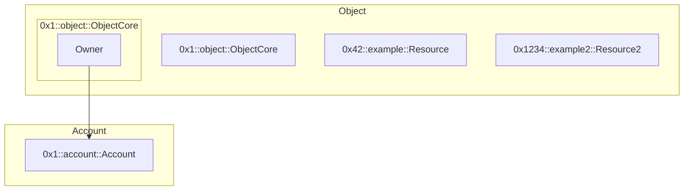

# The Object Model

Objects similar to resource accounts, but rather than using a `SignerCapability` instead a `ExtendRef`
can be used to authenticate for the account. These have owners, and always have the resource `0x1::object::Object`
stored at its address.

TODO: Diagram

