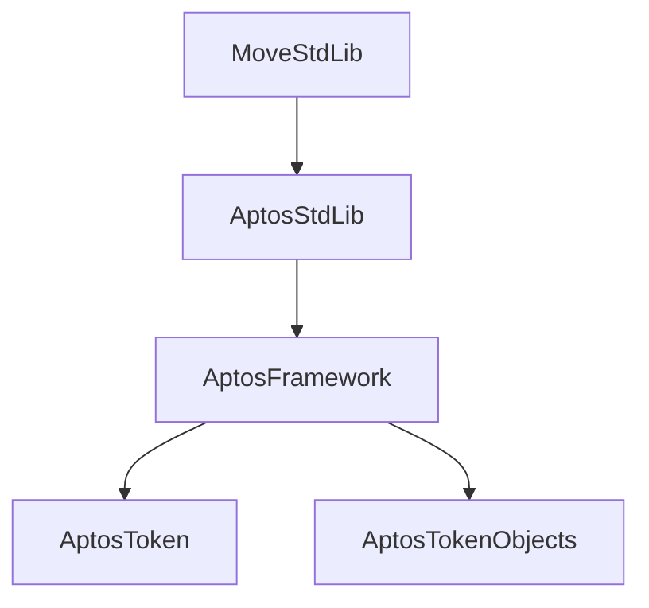

# Aptos Framework

TODO: Link source, possibly give a high level overview

```mermaid
graph
  A[MoveStdLib] --> B[AptosStdLib]
    B --> C[AptosFramework]
    C --> D[AptosToken]
    C --> E[AptosTokenObjects]
```