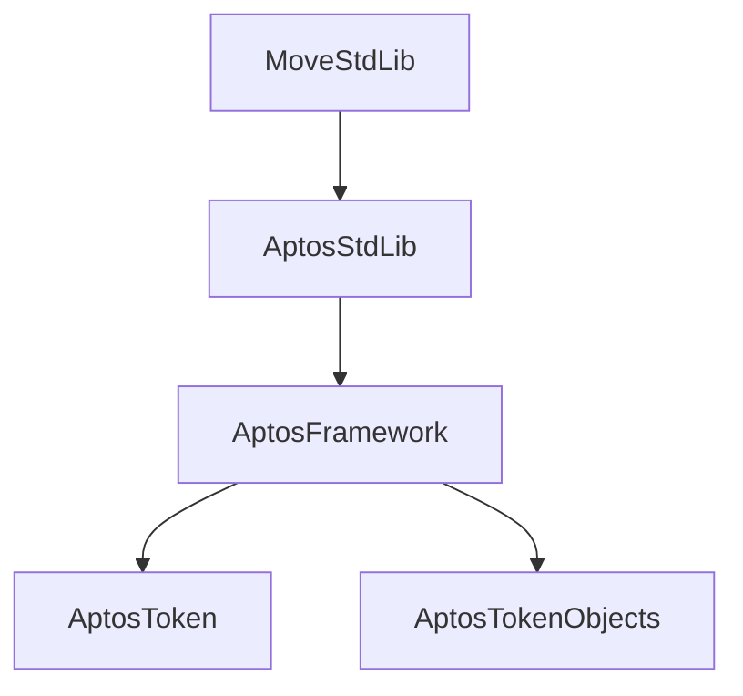

# Aptos Framework

The Aptos Framework (`aptos_framework`) provides the core functionality of the Aptos blockchain, including accounts, coins, objects, governance, and staking. It is deployed at address `0x1` and depends on both MoveStdlib and AptosStdlib.

Source: [aptos-framework/aptos-framework](https://github.com/aptos-labs/aptos-framework/tree/main/aptos-move/framework/aptos-framework)



## Key Modules

### Account Management

#### `aptos_framework::account`

Manages account creation, authentication key rotation, and signer capabilities.

```move
use aptos_framework::account;

// In tests
#[test_only]
fun setup(account: &signer) {
    account::create_account_for_test(signer::address_of(account));
}
```

### Token Standards

#### `aptos_framework::coin`

The legacy fungible token standard (see [Coin (Legacy)](fungible_tokens/coin.md)).

#### `aptos_framework::fungible_asset`

The modern fungible token standard (see [Fungible Asset](fungible_tokens/fungible_assets.md)).

#### `aptos_framework::primary_fungible_store`

Primary stores for fungible assets, automatically created per account.

### Object Framework

#### `aptos_framework::object`

The object model for creating and managing on-chain objects (see [Object Model](../data_models/object_model.md)).

```move
use aptos_framework::object::{Self, Object, ConstructorRef};

fun create_my_object(creator: &signer): ConstructorRef {
    object::create_object(signer::address_of(creator))
}
```

### Events

#### `aptos_framework::event`

Event emission for indexing and observability.

```move
use aptos_framework::event;

#[event]
struct MyEvent has drop, store {
    value: u64,
}

fun emit_event() {
    event::emit(MyEvent { value: 42 });
}
```

### Randomness

#### `aptos_framework::randomness`

On-chain randomness for games, lotteries, and fair selection.

```move
use aptos_framework::randomness;

#[randomness]
entry fun random_action(account: &signer) {
    let random_number = randomness::u64_integer();
}
```

### Governance and Staking

#### `aptos_framework::aptos_governance`

On-chain governance for protocol upgrades and parameter changes.

#### `aptos_framework::staking`

Validator staking and delegation.

### Utilities

#### `aptos_framework::timestamp`

Access the current blockchain timestamp.

```move
use aptos_framework::timestamp;

fun get_current_time(): u64 {
    timestamp::now_seconds()
}
```

#### `aptos_framework::aptos_coin`

The native APT token module.

## Summary

| Module | Purpose |
|---|---|
| `account` | Account management |
| `coin` | Legacy fungible tokens |
| `fungible_asset` | Modern fungible tokens |
| `object` | Object model |
| `event` | Event emission |
| `randomness` | On-chain randomness |
| `timestamp` | Blockchain time |
| `aptos_coin` | Native APT token |
| `aptos_governance` | On-chain governance |
| `staking` | Validator staking |
